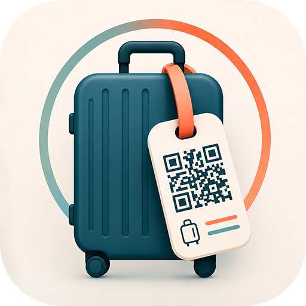
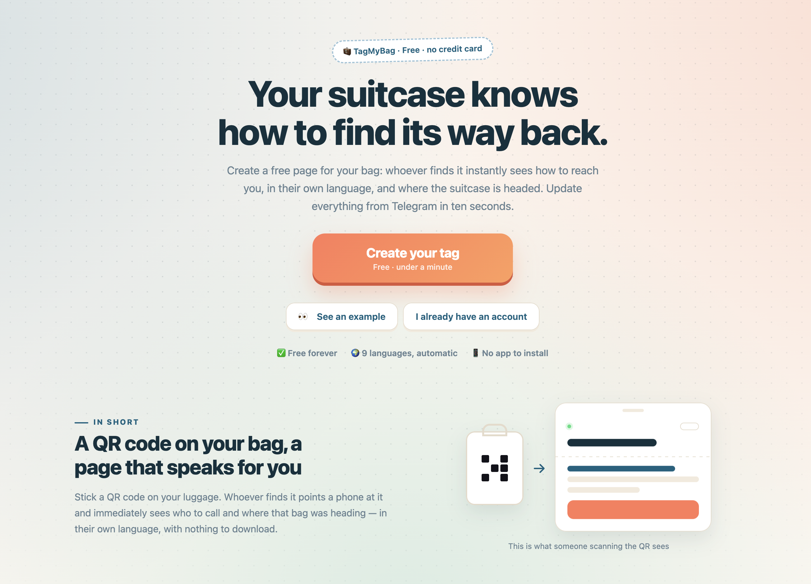

# TagMyBag 🧳

### A smart digital luggage tag, powered by one permanent QR code.

Create and manage your luggage tag from your personal account. If someone finds your bag, they can scan the QR code, understand where it belongs, contact you and — only if they agree — share its current location.

**No app or account is required for the person who finds the bag.**

---

  

## The problem

A traditional luggage tag gives someone a name and a phone number — assuming the handwriting is still readable, the ink has survived the trip and your travel plans have not changed.

TagMyBag gives your suitcase a **digital page that stays up to date**.

You create a tag from your account, choose what information to share, generate the design and attach its QR code to your luggage.

If the bag gets lost, the finder simply scans it.

> 👤 **Finder:** “Where is this suitcase supposed to be?”  
> 🧳 **Suitcase:** “Scan the code. I have an itinerary.”

## How it works

1. **Create an account** and add your luggage.
2. Add the destination, flight numbers, stopovers and contact details you want to share.
3. Choose one of the available tag designs, or download only the QR code to create your own.
4. Print the tag and attach it to the suitcase.
5. Anyone who finds the bag can scan it without registering or installing an app.
6. Update the information at any time from the web interface or directly through Telegram.

  

## What happens after a scan?

The finder can immediately:

- 🌍 Read the luggage page in their language
- 📍 See the intended destination
- ✈️ Check flight numbers and stopovers
- 📞 Contact the owner using the available contact options
- 🔄 View the latest information, even if the itinerary changed after printing
- 🗺️ Share the bag’s current location, **only after giving permission**

That last point matters: TagMyBag does not silently track anyone. Location is shared only when the person scanning the tag explicitly allows it.

## One QR code. Unlimited updates.

The physical QR code does not change when your plans do.

Flight cancelled? **Update it.**  
New connection? **Update it.**  
Different destination? **Update it.**  
Your suitcase landed in Barcelona while you landed in Milan? At least one of you knows what happened.

You can make changes from:

- 💻 The TagMyBag web interface
- 🤖 Telegram, for quick updates while travelling

There is no need to print a new tag every time the itinerary changes.

## Built around the owner — simple for the finder

An account is required to create, personalise and manage a tag because each tag must be securely linked to its owner.

The person who finds the luggage needs none of that.

They do not need to:

- create an account;
- download an app;
- understand how TagMyBag works;
- solve a CAPTCHA while standing next to carousel number seven.

They only need to scan the QR code.

## Personalise the physical tag

TagMyBag can automatically generate a ready-to-print luggage tag with different graphic options.

Prefer your own design? Download the individual QR code and place it on a custom tag, card, sticker or luggage accessory.

The appearance can change. The link to your luggage stays the same.

## Is it a luggage tracker?

Not exactly — and that is the point.

A GPS or Bluetooth tracker helps the owner search for the suitcase.

TagMyBag helps the **person who finds it** understand:

- where it should be;
- how to contact its owner;
- whether the travel details have changed;
- how to share its current location with permission.

A tracker and TagMyBag can be used together because they solve different parts of the same problem.

## The entire idea in one conversation

> 👤 **Finder:** “I found this suitcase.”  
> 🧳 **Suitcase:** “Great. Scan my QR code.”  
> 👤 **Finder:** “I can see the destination, flights and contact the owner.”  
> 🧳 **Suitcase:** “And you can share where I am, if you agree.”  
> 👤 **Finder:** “That was surprisingly easy.”  
> 🧳 **Suitcase:** “I’m lost, not badly designed.”

## Try TagMyBag

🌐 **Website:** [tagmybag.it](https://tagmybag.it/)  
👀 **Live demo:** [tagmybag.it/demo](https://tagmybag.it/demo)

---

### Your suitcase cannot call you. It can still tell people where it belongs.

**One QR code. A smarter way home.**

